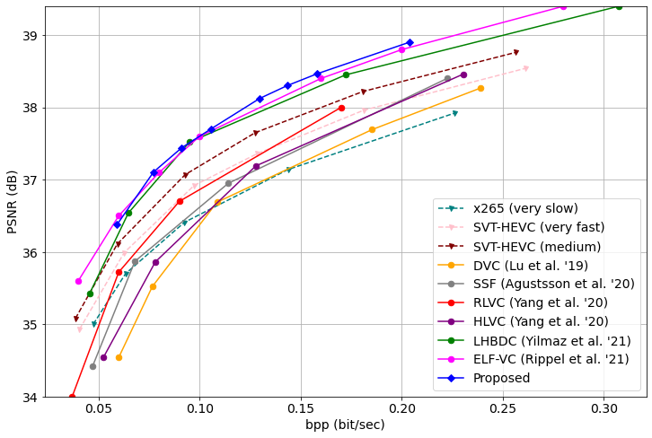

# Flexible-Rate Learned Hierarchical Bi-Directional Video Compression with Motion Refinement and Frame-Level Bit Allocation
This work presents improvements and novel additions to [the recent work](https://github.com/KUIS-AI-Tekalp-Research-Group/video-compression/tree/master/LHBDC) on end-to-end optimized hierarchical bidirectional video compression to further advance the state of-the-art in learned video compression. As an improvement, we combine motion estimation and prediction modules and compress refined residual motion vectors for improved rate-distortion performance. As novel addition, we adapted the gain unit proposed for image compression to flexible-rate video compression in two ways: first, the gain unit enables a single encoder model to operate at multiple rate-distortion operating points; second, we exploit the gain unit to control bit allocation among intra-coded vs. bi-directionally coded frames by fine tuning corresponding models for truly flexible-rate learned video coding. Experimental  results demonstrate that we obtain state-of-the-art rate-distortion performance exceeding those of all prior art in learned video coding.

For further reference, take a look at our [paper](https://arxiv.org/abs/2206.13613). Our paper is accepted for publication in IEEE International Conference on Image Processing ([ICIP 2022](https://2022.ieeeicip.org/)).

<!--
```
@misc{https://doi.org/10.48550/arxiv.2206.13613,
  doi = {10.48550/ARXIV.2206.13613},
  url = {https://arxiv.org/abs/2206.13613},
  author = {Cetin, Eren and Yilmaz, M. Akin and Tekalp, A. Murat},
  keywords = {Image and Video Processing (eess.IV), Computer Vision and Pattern Recognition (cs.CV)}
  title = {Flexible-Rate Learned Hierarchical Bi-Directional Video Compression With Motion Refinement and Frame-Level Bit Allocation},
  publisher = {arXiv},
  year = {2022},
  copyright = {arXiv.org perpetual, non-exclusive license}
}
```
-->

<!-- ## Continuation Work
As an improvement on the proposed network, we also implemented the gained version of the learned intra-coding network proposed by [Minnen et al. (2018)](https://arxiv.org/abs/1809.02736). This idea was proposed by [Cui et al. (2021)](https://openaccess.thecvf.com/content/CVPR2021/html/Cui_Asymmetric_Gained_Deep_Image_Compression_With_Continuous_Rate_Adaptation_CVPR_2021_paper.html). The learned hierarchical bi-directional compression network is kept same as proposed in this repository while the intra-coding network is simply replaced with its gained counterpart. To check our results, you can refer to our [additional folder](https://github.com/KUIS-AI-Tekalp-Research-Group/video-compression/tree/master/Flex-Rate-Hier-Bidir-Video-Compression/continuation_work). -->

## Codes

### Dependency
To download the necessary dependencies, please use the ```environment.yml```
```
conda env create -f environment.yml
```
In addition, the framework uses the ```compressai``` library by Interdigital. The library can be downloaded as described in the [link](https://github.com/InterDigitalInc/CompressAI/).
```
pip install compressai
```

### Testing
To run a test yourself, ```testing.py``` is provided in ```test``` folder. After downloading and placing the [pretrained bidirectional compression model](https://drive.google.com/file/d/1eMRnwBqdRqYVk3m9475ZOIMBpySgBItk/view?usp=sharing) in the main directory, you can run the code

```
cd test
python testing.py
```

## Performance

The rate-distortion performance of the re-implementation as following in terms of PSNR on [UVG dataset](http://ultravideo.fi/#testsequences).


