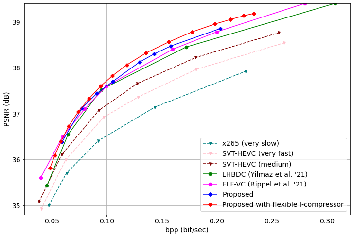

# Flexible-Rate Learned Hierarchical Bi-Directional Video Compression with Motion Refinement and Frame-Level Bit Allocation
This folder contains the continuation of our work on ["Flexible-Rate Learned Hierarchical Bi-Directional Video Compression with Motion Refinement and Frame-Level Bit Allocation"](will be added), implemented at [github repository](https://github.com/erenovic/Flex-Rate-Learned-Hierarchical-Bidirectional-Video-Compression-w-Motion-Refinement).

The learned bi-directional compression network provided in this repository is the same as the work mentioned above. However, this work utilizes the gained intra-coding network which was proposed by [Cui et al. (2021)](https://openaccess.thecvf.com/content/CVPR2021/html/Cui_Asymmetric_Gained_Deep_Image_Compression_With_Continuous_Rate_Adaptation_CVPR_2021_paper.html) and implemented (unofficially) in [this repository](https://github.com/erenovic/Flex-Rate-MBT2018). Using the gained intra-coding network, we achieve even better results compared to our work on "Flexible-Rate Learned Hierarchical Bi-Directional Video Compression with Motion Refinement and Frame-Level Bit Allocation".

<!-- ```
@inproceedings{cui2021asymmetric,
  title={Asymmetric gained deep image compression with continuous rate adaptation},
  author={Cui, Ze and Wang, Jing and Gao, Shangyin and Guo, Tiansheng and Feng, Yihui and Bai, Bo},
  booktitle={Proceedings of the IEEE/CVF Conference on Computer Vision and Pattern Recognition},
  pages={10532--10541},
  year={2021}
}
``` -->


## Codes

### Dependency
To download the necessary dependencies, please use the ```environment.yml```.
```
conda env create -f environment.yml
```
In addition, the framework uses the ```compressai``` library by Interdigital. The library can be downloaded as described in the [link](https://github.com/InterDigitalInc/CompressAI/).
```
pip install compressai
```

### Testing
To run a test yourself, ```testing.py``` is provided in ```test``` folder. After downloading and placing the [pretrained gained intra-coding network](https://drive.google.com/file/d/1SPL-V6ibfoVMx75AYxuNopczo-DAmh1x/view?usp=sharing) and [pretrained gained bi-directional coding network](https://drive.google.com/file/d/14o8Sz4NUDHMXMC2k2B0JKQa80750PsZk/view?usp=sharing) in the main directory, you can run the code.

```
cd test
python testing.py
```

## Performance

The rate-distortion performance of the re-implementation as following in terms of PSNR on [UVG dataset](http://ultravideo.fi/#testsequences).


